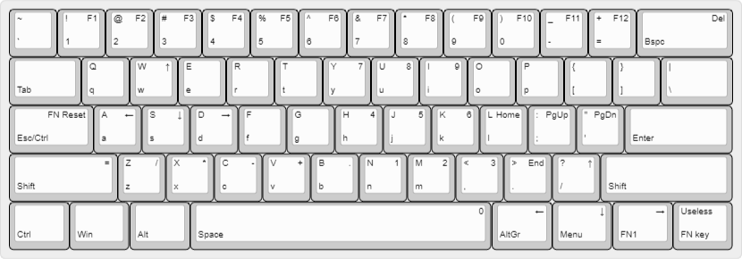

# Motospeed CK61 Kmonad layout

The Motospeed CK61 keyboard misses the grave/tilde key and requires toggling
a layer to access the secondary function of the keys. This makes the keyboard
cumbersome to code on and to use daily. This repo includes a keymap for
[Kmonad](https://github.com/kmonad/kmonad) amending those problems.
It also introduces my personal modifications to the layout.

### Disclaimer

I made this for my own use, tuning it to my own taste, I'm not trying to
follow any convention or standard.
